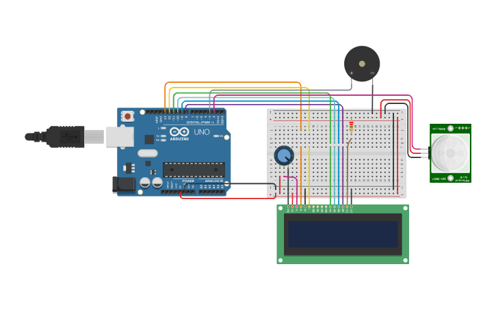
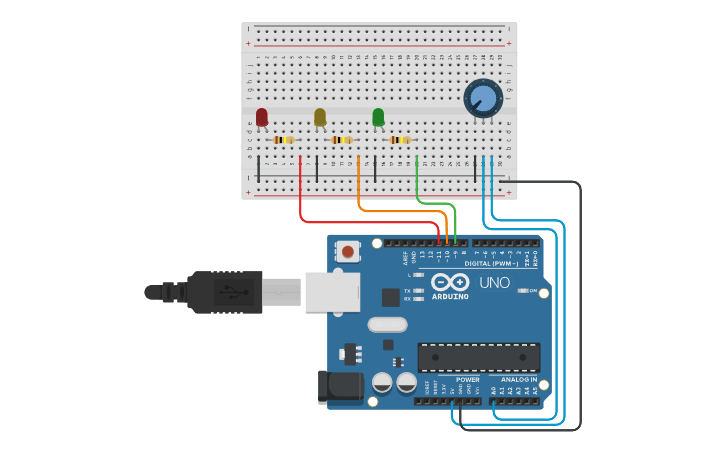
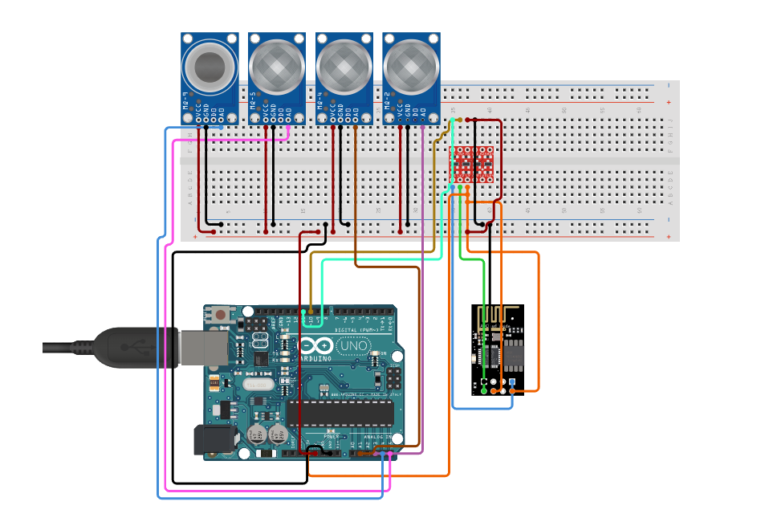

# Arduino

<h3> Codes used in MakSci Projects Dump </h3>

 - <a href = "#user-content-first-heading">group_meralco_pir-sensor.ino</a>
 - <a href = "#user-content-second-heading">three_led_with_a_potentiometer.ino</b>
 - <a href = "#user-content-third-heading">arduino-based_methane_sensors_mq2-mq4-mq5-mq9_with_esp8266.ino</c>

# <h2 id = "first-heading" dir = "auto">group_meralco_pir-sensor.ino</h2>

Operating PIR Sensor as Theft Movement Detection
 - A simple code we used in Grade 12 Physics that detects movement and includes an alarm system for detection purposes. The monitoring display is done using an I2C LCD monitor.
 - Remove the "//" in 'megalovania()' or 'carAlarm()', and add "//" to 'digitalWrite(buzzer, HIGH)' if you want those other sounds to the buzzer. If you want more customized sounds, refer here https://github.com/robsoncouto/arduino-songs and copy paste his commands into a new function.

 
 https://www.tinkercad.com/things/dxc4yy8azmD

# <h2 id = "second-heading" dir = "auto">three_led_with_a_potentiometer.ino</h2>

Controlling 3 LEDs using 1 Potentiometer
 - Fun side project when I bought Arduino for our research project. This uses leveled digital output of the potentiometer (low, medium, and high) and turns on the LED from left to right or vice versa depending on the value set on the potentiometer.

 
 https://www.tinkercad.com/things/dbBClIOAkSH

# <h2 id = "third-heading" dir = "auto">arduino-based_methane_sensors_mq2-mq4-mq5-mq9_with_esp8266.ino</h2>

Using MQ2, MQ4, MQ5, and MQ9 with ESP8266 to send data to Thingspeak Server
 - This is used in our research paper, [Evaluating and Comparing Different Arduino-Based Methane Sensors using Spoiling Onion (Allium cepa L.)]([url](https://docs.google.com/document/d/1bd7KA3-1UeMmHvmkyl4WGBPQK_WAW5VLMbpckR7bOJg/edit)https://docs.google.com/document/d/1bd7KA3-1UeMmHvmkyl4WGBPQK_WAW5VLMbpckR7bOJg/edit), together with [MQSensorsLib]([url](https://github.com/miguel5612/MQSensorsLib)https://github.com/miguel5612/MQSensorsLib) by Urquiza, [WifiEsp]([url](https://github.com/bportaluri/WiFiEsp)https://github.com/bportaluri/WiFiEsp) by Portaluri, and [thingspeak-arduino]([url](https://github.com/mathworks/thingspeak-arduino)https://github.com/mathworks/thingspeak-arduino) by Mathworks. Basically, the paper promotes alternative cost-efficient methane monitoring sensors (MQ2, MQ4, MQ5, and MQ9) for the farmers in the Philippines. The data received from the circuit will be sent to the Thingspeak server using the ESP8266 wifi module.

 

