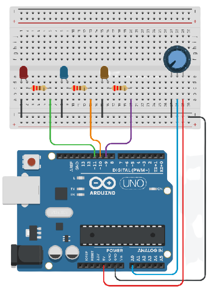

# Arduino

Codes used in MakSci Projects Dump
 - group_meralco_pir-sensor.ino
 - three_led_with_a_potentiometer.ino
 - 

# group_meralco_pir-sensor.ino

Operating PIR Sensor as Theft Movement Detection
 - A simple code we used in Grade 12 Physics that detects movement and includes an alarm system for detection purposes.

 
 https://www.tinkercad.com/things/dxc4yy8azmD

# three_led_with_a_potentiometer.ino

Controlling 3 LEDs using 1 Potentiometer
 - Fun side project when I bought Arduino for our research project. This uses leveled digital output of the potentiometer (low, medium, and high) and turns on the LED from left to right or vice versa depending on the value set on the potentiometer.

 

